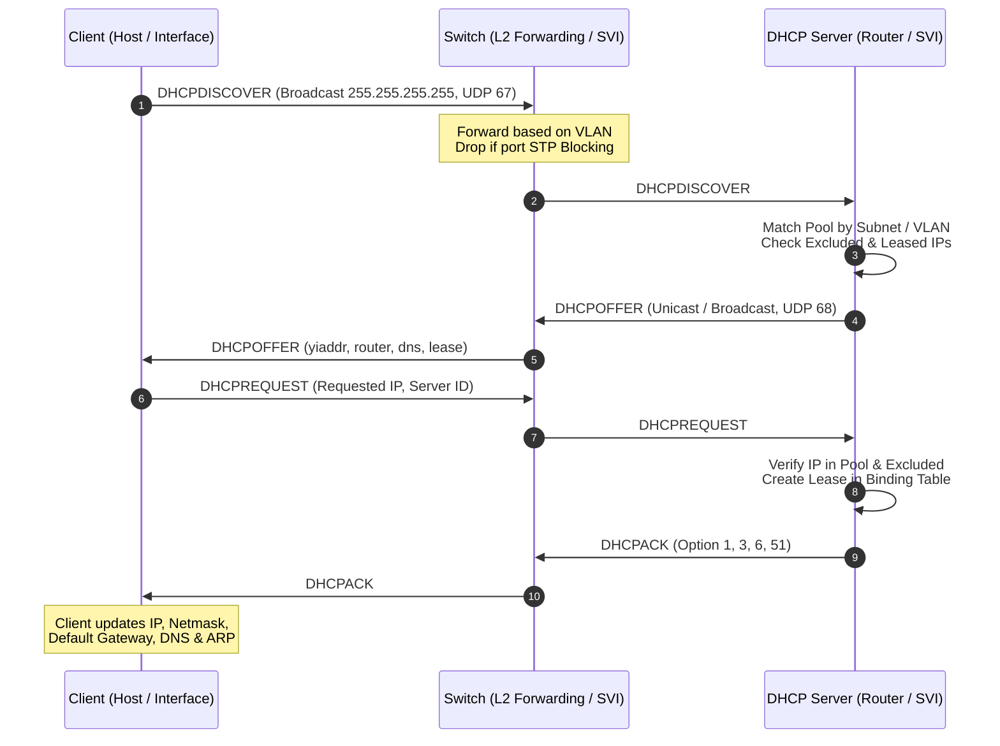

# IPv4 DHCP Architecture & CLI Documentation

เอกสารอธิบายสถาปัตยกรรมและการทำงานของ **Dynamic Host Configuration Protocol (DHCP) IPv4** ในโปรเจกต์ Network Simulator

---

## 1. บทนำ (Introduction & Architecture Overview)

ระบบ DHCP ใน Network Simulator จำลองกระบวนการแจกจ่ายค่าคอนฟิกูเรชัน IPv4 แบบ Dynamic ตามมาตรฐาน **RFC 2131**:
1. **DHCP Server**: รองรับทั้งบน **Router** (Physical interface & 802.1Q subinterfaces) และ **Switch** (Layer 3 SVI)
2. **DHCP Client**: รองรับทั้งบน **Host (Linux PC / Laptop)** ผ่านคำสั่ง `dhclient` และบน **Cisco IOS Devices** ผ่านคำสั่ง `ip address dhcp`
3. **DHCP DORA State Machine**: จำลอง 4 ขั้นตอนหลักอย่างสมบูรณ์:
   - **D**iscover: Client broadcast ค้นหา DHCP Server ใน Broadcast Domain
   - **O**ffer: Server เสนอ IP Address, Subnet Mask, Gateway, DNS, และ Lease Time
   - **R**equest: Client ขอยืนยันการใช้งาน IP Address ที่ได้รับ
   - **A**ck: Server บันทึก Lease ลงใน Binding Table และยืนยันกลับไปยัง Client
4. **VLAN & STP Awareness**:
   - การแจกจ่าย IP แยกขาดตาม Broadcast Domain / VLAN Isolation
   - แพ็กเก็ต DHCP Broadcast จะไม่ถูกส่งผ่านพอร์ตที่ติดสถานะ STP **Blocking** เพื่อป้องกัน Broadcast Loop

---

## 2. โครงสร้างข้อมูลและโมดูล (Modules & Data Structures)

### 2.1 `DHCPPool` (`network/dhcp.py`)
ทำหน้าที่เก็บคุณสมบัติของ IP Pool แต่ละชุด:
- `name`: ชื่อของ Pool (เช่น `LAN`, `VLAN10`, `OFFICE`)
- `network`: Network address (เช่น `192.168.1.0`)
- `subnet_mask`: Subnet mask (เช่น `255.255.255.0` หรือ `/30` = `255.255.255.252`)
- `default_router`: Gateway IP สำหรับใส่ใน Option 3
- `dns_servers`: รายการ DNS Server IP (Option 6)
- `lease_duration`: ระยะเวลา Lease เป็นวินาที (ค่าเริ่มต้น 86400 วินาที = 1 วัน)
- **Subnet Arithmetic**:
  - ตัด Subnet ID (Network Address) และ Directed Broadcast Address ออกจาก IP ที่สามารถแจกได้อัตโนมัติ
  - เช่น `/24` มี Address ทั้งหมด 256 หมายเลข จะแจกได้สูงสุด 254 Hosts
  - เช่น `/30` มี Address ทั้งหมด 4 หมายเลข จะแจกได้สูงสุด 2 Hosts

### 2.2 `DHCPServer` (`network/dhcp.py`)
ติดตั้งอยู่ในอ็อบเจกต์ `Router.dhcp_server` และ `Switch.dhcp_server`:
- `pools`: Dictionary เก็บคอนฟิกูเรชัน Pool `pool_name -> DHCPPool`
- `excluded_addresses`: Set เก็บรวบรวม IP Address ทั้งหมดที่ถูกยกเว้น ไม่ให้แจกจ่าย
- `excluded_ranges`: รายการ `(low_ip, high_ip)` สำหรับแสดงผลใน `show running-config`
- `binding_table`: ตารางการเช่า `ip_address -> DHCPLease`
- `mac_to_ip`: ดัชนี `client_mac -> ip_address` เพื่อให้ Client เดิมได้รับ IP เดิมเมื่อต่ออายุ (Renew/Rediscover)
- `statistics`: ตัวนับสถิติข้อความ (Discover, Offer, Request, Ack, Nak, Release)

### 2.3 `DHCPClient` (`network/dhcp.py` & `network/host.py`)
- `state`: สถานะของ Client (`INIT`, `SELECTING`, `REQUESTING`, `BOUND`, `RENEWING`)
- `current_xid`: Transaction ID แบบสุ่ม/ลำดับ
- `lease`: อ็อบเจกต์ `DHCPLease` ที่ถือครองอยู่

---

## 3. การทำงานร่วมกับระบบเดิม (Integration)

### 3.1 Switch SVI as DHCP Server
Switch สามารถสร้าง SVI และกำหนด DHCP Pool ให้ตรงกับเครือข่ายของ VLAN นั้นๆ ได้ เมื่อ Client ส่ง `DHCPDISCOVER` บนพอร์ต Access ของ VLAN ระบบจะส่งข้อความไปยัง SVI ของ VLAN เดียวกันทันที

### 3.2 Router Subinterfaces (802.1Q Trunking)
Router ที่มี Subinterface เช่น `g0/0.10` (VLAN 10) และ `g0/0.20` (VLAN 20) สามารถสร้าง Pool แยกตาม Subnet ของแต่ละ VLAN ได้:
- เมื่อ `DHCPDISCOVER` เข้ามาพร้อม Tag VLAN 10 จาก Trunk Port ระบบจะ Match กับ Pool ของ Subinterface `.10`
- เมื่อเข้ามาพร้อม Tag VLAN 20 ระบบจะ Match กับ Pool ของ Subinterface `.20`

### 3.3 STP Loop Protection
ในเมธอด `PacketEngine._collect_broadcast_endpoints`:
- พอร์ตที่ถูก STP กำหนดให้อยู่ในสถานะ `Blocking` จะถูกข้าม (Drop) ไม่ให้แพ็กเก็ต DHCP Broadcast ไหลผ่าน
- ป้องกันการเกิด Broadcast Storm และรักษาแนวทางเดินของแพ็กเก็ตตาม Spanning Tree Topology

### 3.4 ARP & Routing Post-DHCP
เมื่อ Client ได้รับ IP Address ผ่าน DHCP:
- `host.ports["eth0"].ip_address` และ `subnet_mask` จะถูกตั้งค่า
- `host.default_gateway` และ `host.dns_server` จะถูกอัปเดต
- โฮสต์สามารถทำ ARP Resolution และส่ง Ping ไปยัง Gateway หรือโฮสต์อื่นๆ ในเครือข่ายได้ทันที

---

## 4. คู่มือคำสั่ง CLI (CLI Command Reference)

### 4.1 Cisco IOS (Router & Switch)

#### Global Configuration Mode `(config)#`
| คำสั่ง | คำอธิบาย |
|---|---|
| `ip dhcp pool <name>` | สร้าง DHCP Pool และเข้าสู่โหมด `(dhcp-config)#` |
| `no ip dhcp pool <name>` | ลบ DHCP Pool และยกเลิก Lease ทั้งหมดที่ผูกอยู่ |
| `ip dhcp excluded-address <low_ip> [high_ip]` | กำหนดหมายเลข IP หรือช่วง IP ที่ยกเว้นไม่ให้แจก |
| `no ip dhcp excluded-address <low_ip> [high_ip]` | ยกเลิกการยกเว้น IP |

#### DHCP Pool Configuration Mode `(dhcp-config)#`
| คำสั่ง | คำอธิบาย |
|---|---|
| `network <net_ip> <subnet_mask>` | กำหนด Subnet และ Netmask ของ Pool (เช่น `network 192.168.1.0 255.255.255.0`) |
| `network <net_ip>/<prefix>` | กำหนด Subnet แบบ CIDR prefix (เช่น `network 192.168.1.0/24`) |
| `default-router <ip>` | กำหนด Default Gateway สำหรับแจกให้ Client |
| `dns-server <ip1> [ip2 ...]` | กำหนด DNS Server IPv4 |
| `lease <days> [hours] [minutes]` | กำหนดอายุการเช่า IP (เช่น `lease 7` หรือ `lease 3 12 0`) |
| `lease infinite` | กำหนดอายุการเช่าไม่จำกัด |
| `exit` | ออกกลับไปยัง Global Config Mode |

#### Interface Configuration Mode `(config-if)#`
| คำสั่ง | คำอธิบาย |
|---|---|
| `ip address dhcp` | สั่งให้อินเทอร์เฟซของ Router/SVI ขอ IP จาก DHCP Server |
| `no ip address` | ลบ IP Address ออกจากอินเทอร์เฟซ |

#### Privileged EXEC Mode `(#)`
| คำสั่ง | คำอธิบาย |
|---|---|
| `show ip dhcp pool [name]` | แสดงรายละเอียดของ Pool, จำนวน IP ทั้งหมด, ที่ถูกแจก, และที่ถูกยกเว้น |
| `show ip dhcp binding` | แสดงตาราง Binding รายการ IP Address และ Client MAC Address |
| `show ip dhcp statistics` | แสดงสถิติการรับ-ส่งข้อความ DHCP (Discover, Offer, Request, Ack, Nak, Release) |

---

### 4.2 Linux Host (PC / Laptop)

| คำสั่ง | คำอธิบาย |
|---|---|
| `dhclient [interface]` | ส่ง DHCPDISCOVER เพื่อขอรับ IPv4 Address แบบไดนามิก |
| `dhclient -r [interface]` | ปลดปล่อย (Release) IP Address คืนกลับสู่ DHCP Server |
| `ifconfig` หรือ `ip addr` | ตรวจสอบการตั้งค่า IP Address, Subnet Mask และ Gateway |
