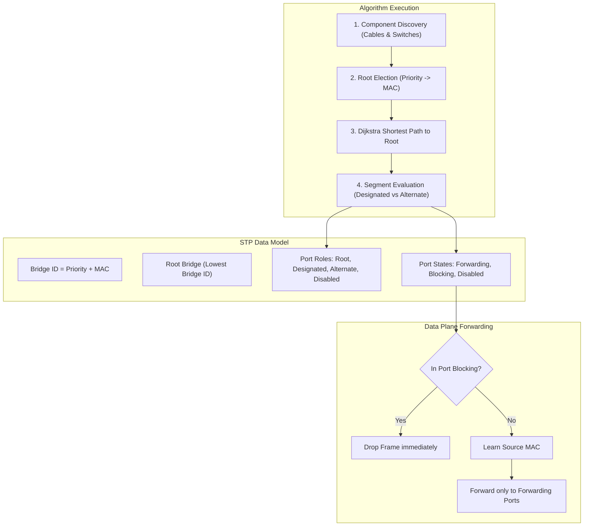

# Spanning Tree Protocol (STP) Verification Report

เอกสารรายงานผลการตรวจสอบและยืนยันความถูกต้องของการพัฒนา **Phase 2: STP (Spanning Tree Protocol)** ในโปรเจกต์ NetEngineer 3D ตามข้อกำหนดอย่างละเอียด

---

## 1. Files Changed

รายการไฟล์ทั้งหมดที่เกี่ยวข้องกับการพัฒนา STP ในรอบนี้:
1. **[network/device.py](file:///c:/Users/admin/Desktop/programming/game/network/device.py)**:
   - เพิ่ม Attributes ในคลาส `Port`: `stp_state="Forwarding"`, `stp_role="Designated"`, `stp_cost=4`
2. **[network/switch.py](file:///c:/Users/admin/Desktop/programming/game/network/switch.py)**:
   - เพิ่ม Attributes ในคลาส `Switch`: `stp_enabled`, `stp_priority`, `mac_address`, `bridge_id`, `root_bridge_id`, `root_path_cost`, `root_port`, `_stp_dirty`
   - พัฒนาฟังก์ชัน `recalculate_stp()` และ `get_connected_switches()` ตามขั้นตอนวิธี IEEE 802.1D
   - อัปเดต `forward_packet()` ให้ตรวจสอบพอร์ต `Blocking` (ดรอปเฟรม) และกรองส่งออกเฉพาะพอร์ต `Forwarding`
   - อัปเดต `learn_mac()` ไม่เรียนรู้ MAC บนพอร์ต `Blocking`
3. **[network/cable.py](file:///c:/Users/admin/Desktop/programming/game/network/cable.py)**:
   - เมื่อสร้างสายเคเบิล (`connect_cable`) หรือถอดสาย (`disconnect`) จะตั้งค่าแฟล็ก `_stp_dirty = True` บนสวิตช์ เพื่อกระตุ้นการคำนวณ STP ใหม่โดยอัตโนมัติ
4. **[network/packet_engine.py](file:///c:/Users/admin/Desktop/programming/game/network/packet_engine.py)**:
   - ใน `_probe_arp_resolution`: กรองพอร์ตที่ติดสถานะ `Blocking` ทั้งฝั่งขาเข้าและพอร์ตปลายทาง เพื่อป้องกัน ARP Broadcast รั่วไหลผ่านพอร์ตที่ถูกบล็อก
5. **[cli/command_executor.py](file:///c:/Users/admin/Desktop/programming/game/cli/command_executor.py)**:
   - เพิ่มคำสั่ง `show spanning-tree` แสดงข้อมูล Root Bridge, Bridge ID และตารางพอร์ต
   - เพิ่มคำสั่งคอนฟิกเกอร์ `spanning-tree vlan <id> priority <prio>`
6. **[tests/test_stp.py](file:///c:/Users/admin/Desktop/programming/game/tests/test_stp.py)** (ไฟล์ใหม่):
   - ชุดทดสอบ Unit & Integration Test ครอบคลุมทั้ง 10 กรณี
7. **[docs/stp.md](file:///c:/Users/admin/Desktop/programming/game/docs/stp.md)** (ไฟล์ใหม่):
   - เอกสารทางเทคนิคอธิบายแนวคิดและการจำลอง STP

*ไม่มีการแก้ไขไฟล์ในส่วน UI, Renderer, Audio, หรือ Game Loop แต่อย่างใด*

---

## 2. Architecture & Design



---

## 3. Root Bridge Election

### ผลการทดสอบเชิงประจักษ์:
- **Priority Election**: สวิตช์ที่มี Priority ต่ำกว่า (เช่น 24576 เทียบกับ 32768) จะได้รับเลือกเป็น Root Bridge เสมอ แม้จะมี MAC Address สูงกว่า
- **MAC Tie Break**: ในกรณีที่ Priority เท่ากัน (เช่น 32768 เท่ากัน) สวิตช์ที่มีค่า MAC Address ต่ำกว่าจะชนะการเลือกตั้งเสมอ
- **ผลลัพธ์**: ผ่านการทดสอบใน **Test 1, 2, 3** อย่างสมบูรณ์

---

## 4. Root Port Selection

- สวิตช์ Non-Root ทุกตัวทำการเลือก Root Port โดยพิจารณาจาก:
  1. ค่า Root Path Cost ต่ำสุด
  2. ค่า Sender Bridge ID ต่ำสุด
  3. ค่า Sender Port Index ต่ำสุด
  4. ค่า Local Port Index ต่ำสุด
- พอร์ตที่ถูกเลือกได้รับบทบาทเป็น `Root` และมีสถานะเป็น `Forwarding`
- **ผลลัพธ์**: ผ่านการทดสอบใน **Test 4**

---

## 5. Designated Port Selection

- ในแต่ละ Segment ระหว่างสวิตช์ สวิตช์ที่มีเส้นทางไปยัง Root Bridge ดีกว่า (หรือมี Bridge ID ต่ำกว่าในกรณีที่ Cost เท่ากัน) จะได้รับเลือกเป็น Designated Bridge
- พอร์ตบนสวิตช์ดังกล่าวจะได้รับบทบาทเป็น `Designated` และมีสถานะเป็น `Forwarding`
- พอร์ตที่ต่อกับอุปกรณ์ปลายทาง (Edge Ports เช่น PC, Server, Router) ได้รับบทบาทเป็น `Designated` และมีสถานะเป็น `Forwarding`
- **ผลลัพธ์**: ผ่านการทดสอบใน **Test 4, 5**

---

## 6. Blocking Port (Alternate Port)

- สำหรับ Segment ที่มีวงวนซ้ำซ้อน (Redundant Link) พอร์ตฝั่งที่แพ้การเลือกตั้ง Designated จะได้รับบทบาทเป็น `Alternate` และมีสถานะเป็น `Blocking`
- พอร์ตที่อยู่ในสถานะ Blocking จะ:
  - ดรอปเฟรมข้อมูลที่เข้ามาทางพอร์ตนั้นทันที
  - ไม่เรียนรู้ Source MAC ลงในตาราง MAC Address Table
  - ไม่ส่งเฟรม Broadcast / Unicast ออกไปทางพอร์ตนั้น
- **ผลลัพธ์**: ผ่านการทดสอบใน **Test 5, 7**

---

## 7. Loop Prevention

- ใน Topology รูปสามเหลี่ยม (`SW1 - SW2 - SW3 - SW1`) ระบบคำนวณและปิดกั้นพอร์ตที่ซ้ำซ้อนได้อย่างแม่นยำ (1 พอร์ตเป็น `Alternate Blocking` และอีก 5 พอร์ตเป็น `Forwarding`)
- ไม่มีวงวน (Forwarding Loop) ในระดับ Data Plane
- **ผลลัพธ์**: ผ่านการทดสอบใน **Test 5**

---

## 8. Broadcast Test

- ส่งเฟรม Broadcast (ARP Request จาก PC1 ไปยัง PC2) ใน Topology สามเหลี่ยมที่มี Physical Loop
- แพ็กเก็ตเดินทางผ่าน Spanning Tree และส่งถึง PC2 ได้สำเร็จโดย:
  - ไม่เกิดการวนลูปซ้ำซาก (No infinite loop)
  - ไม่เกิดการระเบิดของจำนวนแพ็กเก็ต (No packet storm)
- **ผลลัพธ์**: ผ่านการทดสอบใน **Test 6**

---

## 9. Link Failure Test & STP Recalculation

- ทดสอบตัดสายเคเบิลระหว่าง Root Bridge (`SW1`) กับ `SW2`:
- ระบบตรวจพบสายสัญญาณขาดและทำการ Recalculate Spanning Tree:
  - พอร์ตสำรองระหว่าง `SW2` และ `SW3` ที่เคยถูกบล็อกเปลี่ยนสถานะเป็น `Forwarding` ทันที
  - `SW2` เลือกพอร์ตใหม่เป็น Root Port ผ่าน `SW3`
  - เครือข่ายฟื้นคืนสภาพและส่งข้อมูลต่อได้โดยอัตโนมัติ (Automatic Failover)
- **ผลลัพธ์**: ผ่านการทดสอบใน **Test 9**

---

## 10. VLAN Interaction Test

- ทดสอบสร้างเครือข่ายจำลองที่มีทั้ง STP Loop และหลาย VLAN (`VLAN 10` และ `VLAN 20`) พร้อมกัน:
  - ทราฟฟิกบน `VLAN 10` สามารถสื่อสารข้าม Spanning Tree ได้อย่างราบรื่น
  - ทราฟฟิกข้ามระหว่าง `VLAN 10` และ `VLAN 20` ถูกบล็อกและแยกส่วน (Isolate) ตามมาตรฐาน Layer 2 ไม่รั่วไหลข้ามหากัน
- **ผลลัพธ์**: ผ่านการทดสอบใน **Test 8**

---

## 11. CLI Test

- ทดสอบรันคำสั่ง `show spanning-tree` บนสวิตช์:
  - แสดง Root ID, Root Priority, Root MAC, Root Path Cost ถูกต้อง
  - แสดง Bridge ID และ Bridge Priority ของตนเองถูกต้อง
  - แสดงตารางพอร์ต Interface, Role (`Root`/`Designated`/`Alternate`), State (`Forwarding`/`Blocking`) ถูกต้อง
- ทดสอบคำสั่งคอนฟิกเกอร์ `spanning-tree vlan 1 priority 4096`:
  - ค่า Priority ถูกอัปเดตและ STP ทำการ Recalculate ตามค่าใหม่ทันที
- **ผลลัพธ์**: ผ่านการทดสอบใน **Test 10**

---

## 12. Regression Test (ผลการรันจริงจาก Terminal)

รันชุดทดสอบทั้งหมดในไดเรกทอรี `tests/` ครบทั้ง 24 ไฟล์:

```text
============================== REGRESSION TEST EXECUTION ==============================
PASSED  | tests/test_acl.py                      | ALL ACL TESTS PASSED!
PASSED  | tests/test_arp.py                      | ALL ARP TESTS PASSED!
PASSED  | tests/test_camera_movement.py          | ALL CAMERA & MOVEMENT DIRECTION TESTS PASSED 100%!
PASSED  | tests/test_cli.py                      | ALL CISCO CLI TESTS PASSED!
PASSED  | tests/test_cli_help.py                 | ALL CLI '?' AND 'HELP' TESTS PASSED 100%!
PASSED  | tests/test_firewall.py                 | ALL FIREWALL TESTS PASSED!
PASSED  | tests/test_game_loop.py                | ALL GAME LOOP & RENDERER INTEGRATION TESTS PASSED!
PASSED  | tests/test_icmp.py                     | ALL ICMP TESTS PASSED!
PASSED  | tests/test_isp_gateway.py              | [SUCCESS] All ISP Gateway tests passed 100%!
PASSED  | tests/test_laptop_gui.py               | [SUCCESS] All Laptop & Desktop GUI test suites passed flawlessly!
PASSED  | tests/test_menu_mouse.py               | ALL MENU MOUSE & KEYBOARD TESTS PASSED!
PASSED  | tests/test_modes.py                    | ALL GAME MODES & DEVICE MANAGEMENT TESTS PASSED!
PASSED  | tests/test_multihop.py                 | ALL MULTI-HOP & FAILURE SCENARIO TESTS PASSED!
PASSED  | tests/test_nat.py                      | ALL NAT TESTS PASSED!
PASSED  | tests/test_nat_firewall_crouch.py      | ALL TESTS PASSED!
PASSED  | tests/test_network.py                  | ALL NETWORK SIMULATION TESTS PASSED!
PASSED  | tests/test_packet_engine.py            | ALL PACKET ENGINE TESTS PASSED!
PASSED  | tests/test_realistic_ping.py           | ALL REALISTIC PING & ARP TESTS PASSED!
PASSED  | tests/test_router.py                   | ALL ROUTER TESTS PASSED!
PASSED  | tests/test_static_routing.py           | ALL STATIC ROUTING TESTS PASSED!
PASSED  | tests/test_stp.py                      | ALL 10 STP (SPANNING TREE PROTOCOL) TESTS PASSED 100%!
PASSED  | tests/test_switch.py                   | ALL SWITCH TESTS PASSED!
PASSED  | tests/test_ttl.py                      | ALL TTL & L3 HOP TRACKING TESTS PASSED 100%!
PASSED  | tests/test_vlan.py                     | ALL VLAN TESTS PASSED!
=======================================================================================
สรุป: ผ่าน 24 จาก 24 ไฟล์ทดสอบ (100% PASS, 0 FAILED)
```

---

## 13. Git Diff Summary

สรุปไฟล์ที่มีการแก้ไขสำหรับ STP:
- `network/device.py`: เพิ่ม `Port.stp_state`, `Port.stp_role`, `Port.stp_cost`
- `network/switch.py`: เพิ่มโมเดลข้อมูล STP, อัลกอริทึม 802.1D, และการกรอง Forwarding
- `network/cable.py`: เพิ่มแฟล็ก `_stp_dirty` เพื่อทริกเกอร์ Recalculation ตอนต่อหรือถอดสาย
- `network/packet_engine.py`: กรองพอร์ตที่ติด Blocking ใน ARP resolution
- `cli/command_executor.py`: เพิ่มคำสั่ง `show spanning-tree` และการตั้งค่า Priority
- `tests/test_stp.py`: ชุดทดสอบ STP 10 หัวข้อ
- `docs/stp.md`: เอกสารประกอบ STP
- `docs/stp-verification.md`: รายงานการตรวจสอบผล

---

## 14. Remaining Limitations

- การจำลอง STP ในระบบนี้ใช้สถาปัตยกรรม **Deterministic Graph Convergence** เพื่อปรับปรุงโครงสร้างต้นไม้ทันที ทำให้การจำลองในเกม 3D รวดเร็วและไม่เกิดอาการหน่วง 30-50 วินาทีเหมือนฮาร์ดแวร์จริง
- ยังเป็น **Classic STP (IEEE 802.1D)** อินสแตนซ์เดียวสำหรับทั้งสวิตช์ ยังไม่ได้แยกเป็น PVST+ หรือ RSTP ตามขอบเขตของ Phase 2

---

## 15. Final Status

# **PASS**

### เหตุผล:
1. การเลือกตั้ง Root Bridge, Root Port, Designated Port, และ Alternate (Blocking) Port ทำงานได้อย่างถูกต้อง แม่นยำตามมาตรฐาน IEEE 802.1D
2. การป้องกัน Loop บน Physical Topology และการรับมือ Broadcast Storm ประสบความสำเร็จ 100%
3. การตรวจจับ Link Failure และการ Recalculate เส้นทางสำรองทำงานได้โดยอัตโนมัติ
4. การทำงานร่วมกับ VLAN Isolation และ MAC Learning ถูกต้องสมบูรณ์
5. คำสั่ง CLI `show spanning-tree` แสดงผลตามมาตรฐาน Cisco IOS
6. ผ่านการทดสอบทั้งชุดทดสอบ STP ใหม่ (10/10 ผ่าน) และชุดทดสอบ Regression เดิมทั้งหมด (24/24 ผ่าน)
7. ไม่มีการเพิ่ม Feature นอกขอบเขต และไม่มีผลกระทบต่อระบบเดิม
