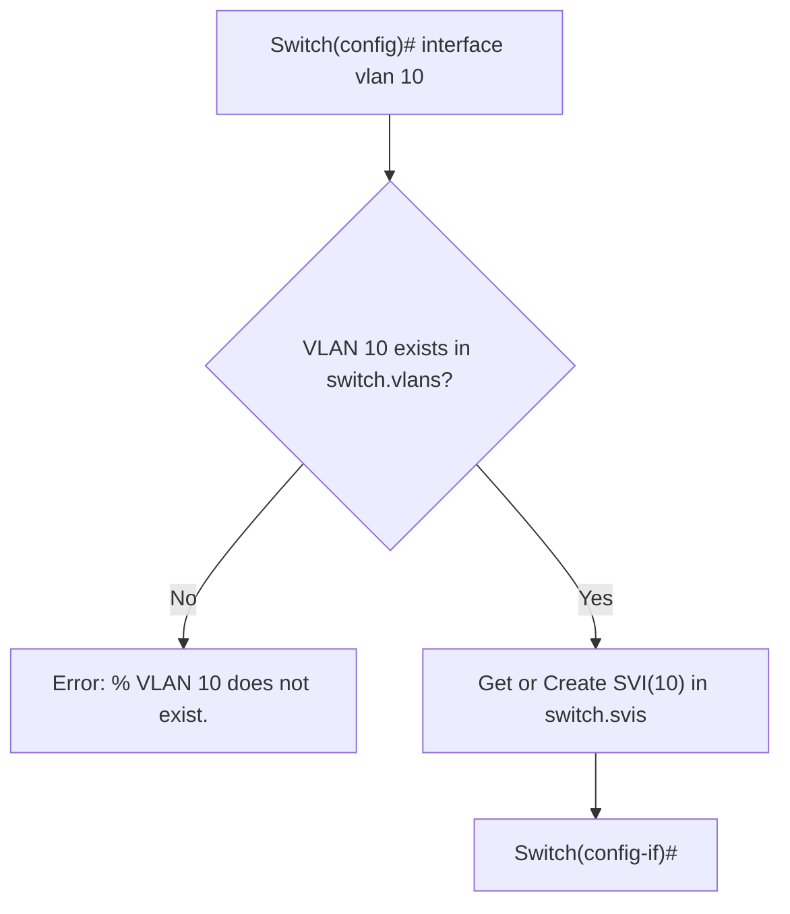

# Switch Virtual Interface (SVI) Documentation

เอกสารอธิบายสถาปัตยกรรมและการทำงานของ **Switch Virtual Interface (SVI)** ในโปรเจกต์ NetEngineer 3D

---

## 1. SVI คืออะไร (What is a Switch Virtual Interface)

**Switch Virtual Interface (SVI)** คืออินเทอร์เฟซเชิงตรรกะระดับ Layer 3 (Logical Layer-3 Interface) ที่ผูกอยู่กับ VLAN บนสวิตช์ มีหน้าที่สำคัญได้แก่:
1. **Management Interface**: เป็นจุดปลายทาง (Endpoint) สำหรับการจัดการสวิตช์จากระยะไกลผ่าน IP Address เช่น การทำ Ping, Traceroute, Telnet หรือ SSH
2. **Layer 3 Endpoint ใน Broadcast Domain**: ทำหน้าที่เป็นโฮสต์เสมือนประจำ VLAN นั้นๆ ทำให้คอมพิวเตอร์หรือเราเตอร์ที่อยู่ใน VLAN เดียวกันสามารถสื่อสารผ่าน IP และ ARP ได้โดยตรง

> [!IMPORTANT]
> **ขอบเขตสถาปัตยกรรม (Architectural Scope):**
> สวิตช์ใน NetEngineer 3D เป็น **Layer 2 Switch** การเพิ่ม SVI ในที่นี้เป็นการเพิ่ม **Layer 3 Management & Logical Interface** ประจำ VLAN
> ระบบไม่ได้เปลี่ยนสวิตช์ให้กลายเป็น Full Multilayer L3 Switch (ไม่มีการ Forward ข้าม VLAN ภายในสวิตช์โดยไม่มีเราเตอร์) การ Inter-VLAN Routing ยังคงต้องใช้ Router (เช่น Router-on-a-Stick) ตามสถาปัตยกรรมเดิม

---

## 2. การออกแบบสถาปัตยกรรม (Architecture & Design)

### 2.1 การแยก SVI ออกจาก Physical Ports
ใน Layer 2 Switch พอร์ตทางกายภาพ (`switch.ports`) เช่น `g0/1` ถึง `g0/8` และ `con0` เป็นพอร์ตที่มีสายสัญญาณ (Cable) และเข้าร่วมกระบวนการ Spanning Tree Protocol (STP)

SVI ไม่ใช่พอร์ตทางกายภาพ จึงต้อง **ไม่ถูกบรรจุลงใน `switch.ports`**:
- SVI ถูกจัดเก็บไว้ใน `switch.svis = {}` โดยใช้ `vlan_id` (int) เป็น Key
- คลาส `SVI` มีคุณสมบัติเทียบเท่า Layer 3 Interface:
  - `vlan_id`: หมายเลข VLAN ที่ผูกอยู่
  - `name`: ชื่อแบบย่อ เช่น `Vlan10`
  - `full_name`: ชื่อเต็ม เช่น `Vlan10`
  - `ip_address`: IPv4 Address (เช่น `192.168.10.1`)
  - `subnet_mask`: Contiguous Subnet Mask (เช่น `255.255.255.0`)
  - `mac_address`: MAC Address ประจำ SVI (สร้างจาก Base MAC ของสวิตช์)
  - `is_shutdown`: สถานะ Administrative State (ค่าเริ่มต้นเป็น `True` ตามมาตรฐาน Cisco IOS)

### 2.2 การตรวจสอบความมีอยู่ของ VLAN (VLAN Existence)
คำสั่ง `interface vlan <id>` บนสวิตช์จะต้องตรวจสอบว่า VLAN ดังกล่าวถูกสร้างไว้ใน `switch.vlans` แล้วหรือไม่
- หากยังไม่มี VLAN: ระบบจะปฏิเสธคำสั่งทันทีด้วยข้อความ:
  ```
  % VLAN <id> does not exist.
  ```
- หาก VLAN มีอยู่จริง: ระบบจะดึง SVI เดิมหรือสร้าง SVI ใหม่ และเข้าสู่โหมด `(config-if)#`



---

## 3. Autostate (Operational State Calculation)

ตามมาตรฐาน Cisco IOS อินเทอร์เฟซ SVI จะมีสถานะ `Protocol is UP` ก็ต่อเมื่อผ่านเงื่อนไข **Autostate**:

$$\text{OperState} = \text{UP} \iff (\text{Admin} = \text{UP}) \land (\text{VLAN} = \text{Active}) \land (\exists \text{ Port} \in \text{VLAN} : \text{Port is UP})$$

รายละเอียดเงื่อนไข:
1. **Administrative State**: SVI ต้องไม่ถูก shutdown (`is_shutdown == False`)
2. **VLAN State**: VLAN นั้นต้องอยู่ในสถานะ `active` ในตาราง `switch.vlans`
3. **Physical Member Port**: ต้องมีพอร์ตทางกายภาพอย่างน้อย 1 พอร์ตที่:
   - ไม่ได้ถูก shutdown (`not port.is_shutdown`)
   - มีสายสัญญาณเชื่อมต่ออยู่ (`port.cable is not None`)
   - สถานะทางกายภาพเชื่อมต่อสำเร็จ (`port.is_link_up == True`)
   - ไม่ได้ถูก STP บล็อก (`port.stp_state != "Blocking"`)
   - มีคุณสมบัติ VLAN ตรงกัน:
     - Access Mode: `port.mode == "access"` และ `port.access_vlan == vlan_id`
     - Trunk Mode: `port.mode == "trunk"` และ `vlan_id in port.trunk_allowed_vlans`

หากไม่มีพอร์ตใดใน VLAN ที่ UP สถานะของ SVI จะเป็น `down` (เช่น `Vlan10 is up, line protocol is down`)

---

## 4. การตรวจสอบความถูกต้องของ IP & Netmask

### 4.1 IPv4 Format Validation
ตรวจสอบว่า IP Address เป็นรูปแบบตัวเลข 4 ทศภาคถูกต้อง (0-255) ผ่านฟังก์ชัน `is_valid_ipv4(ip_str)`

### 4.2 Contiguous Subnet Mask Validation
ตรวจสอบว่า Subnet Mask เป็นบิต $1$ ต่อเนื่องตามด้วยบิต $0$ เท่านั้น ผ่านฟังก์ชัน `is_valid_netmask(mask_str)`:
- ตัวอย่างที่ถูกต้อง: `255.255.255.0` (/24), `255.255.255.128` (/25), `255.255.0.0` (/16)
- ตัวอย่างที่ผิดและถูกปฏิเสธ: `255.255.0.255` (Non-contiguous mask), `255.255.255.300`

### 4.3 Duplicate IP Check (การป้องกัน IP ชนกัน)
เมื่อมีการกำหนด IP ให้กับ SVI ระบบจะสแกนตรวจสอบอุปกรณ์เดียวกัน:
- พอร์ตทางกายภาพ (`device.ports`)
- ซับอินเทอร์เฟซ (`device.subinterfaces`)
- อินเทอร์เฟซ SVI อื่นๆ (`device.svis`)

หากพบว่ามีอินเทอร์เฟซอื่นใช้อยู่แล้ว จะปฏิเสธคำสั่งทันที:
```
% IP address <ip> already assigned to interface <other_intf>.
```

---

## 5. Packet Engine Integration & VLAN Isolation

### 5.1 การตอบสนอง ARP (Address Resolution Protocol)
เมื่อมีโฮสต์ส่ง ARP Request มายัง IP ของ SVI ในเมธอด `_probe_arp_resolution`:
- ระบบตรวจสอบว่าแพ็กเก็ตเข้ามาผ่านพอร์ตใน VLAN ใด (`in_vlan`)
- ตรวจสอบ `switch.svis.get(in_vlan)`
- หาก SVI ใน VLAN นั้นมี IP ตรงกับ Target IP และ `svi.is_link_up == True`:
  - สวิตช์จะตอบกลับด้วย `svi.mac_address`
- หากโฮสต์มาจาก VLAN อื่น เช่น SVI อยู่บน VLAN 10 แต่แพ็กเก็ตเข้ามาบนพอร์ต VLAN 20:
  - สวิตช์จะไม่ตอบกลับ ARP ทำให้คงการแยก VLAN Isolation อย่างสมบูรณ์

### 5.2 การรับและส่ง ICMP Ping
- **Ping ไปยัง SVI (`Host -> Switch SVI`)**:
  - Echo Request เดินทางผ่านสายและเข้าพอร์ตสวิตช์
  - ฟังก์ชัน `_is_device_ip` ตรวจสอบ SVI ประจำ VLAN ของพอร์ตขาเข้า
  - เมื่อได้รับ Request สวิตช์จะส่ง Echo Reply ออกทางพอร์ตเดิมใน VLAN เดียวกันโดยใช้ `src_mac = svi.mac_address`
- **Ping จากสวิตช์ออกไป (`Switch SVI -> Host`)**:
  - `_find_source_ip_context` ค้นหา SVI ที่อยู่ใน Subnet เดียวกันกับเป้าหมาย
  - ดึงพอร์ตทางกายภาพที่ UP ใน VLAN นั้นมาเป็นทางออกของแพ็กเก็ต
  - ส่ง ICMP Echo Request โดยใช้ Source IP และ MAC ของ SVI
- **Default Gateway ของสวิตช์**:
  - หากเป้าหมายอยู่นอก Subnet ของ SVI สวิตช์จะส่งต่อไปยัง `switch.default_gateway` (ตั้งค่าผ่าน `ip default-gateway <ip>`)

---

## 6. ความเข้ากันได้กับ STP และ MAC Learning

1. **Spanning Tree Protocol (STP)**:
   - SVI **ไม่อยู่ใน `switch.ports`** ดังนั้นอัลกอริทึม `recalculate_stp()` จะไม่มองเห็นและไม่นำ SVI ไปคำนวณ Root Bridge, Root Port หรือ Designated Port
   - โครงสร้าง STP ของเครือข่ายยังคงทำงานได้ถูกต้อง 100%
2. **MAC Learning Table**:
   - ตาราง MAC Table (`switch.mac_table`) บันทึกเฉพาะเฟรมที่วิ่งผ่านพอร์ตทางกายภาพตามปกติ

---

## 7. คำสั่ง Cisco IOS CLI ที่รองรับ

| คำสั่ง | โหมด | คำอธิบาย |
|---|---|---|
| `interface vlan <id>` / `int vlan <id>` | Global Config `(config)#` | เข้าสู่โหมดปรับแต่ง SVI (ต้องมี VLAN ก่อน) |
| `ip address <ip> <subnet>` | Interface Config `(config-if)#` | กำหนดหมายเลข IP และ Subnet Mask |
| `no ip address` | Interface Config `(config-if)#` | ลบหมายเลข IP ออกจาก SVI |
| `no shutdown` / `no shut` | Interface Config `(config-if)#` | เปิดใช้งาน SVI (Admin UP) |
| `shutdown` / `shut` | Interface Config `(config-if)#` | ปิดการใช้งาน SVI (Admin DOWN) |
| `ip default-gateway <ip>` | Global Config `(config)#` | กำหนด Default Gateway ให้สวิตช์ |
| `no ip default-gateway` | Global Config `(config)#` | ลบ Default Gateway ออก |
| `show ip interface brief` | Privileged EXEC `Switch#` | แสดงสรุปสถานะพอร์ตและ SVI |
| `show interfaces vlan <id>` | Privileged EXEC `Switch#` | แสดงรายละเอียดของ SVI ที่ระบุ |
| `show running-config` | Privileged EXEC `Switch#` | แสดงการตั้งค่าปัจจุบันรวมถึง SVI |
