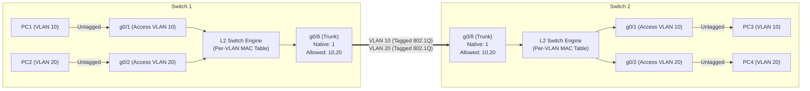
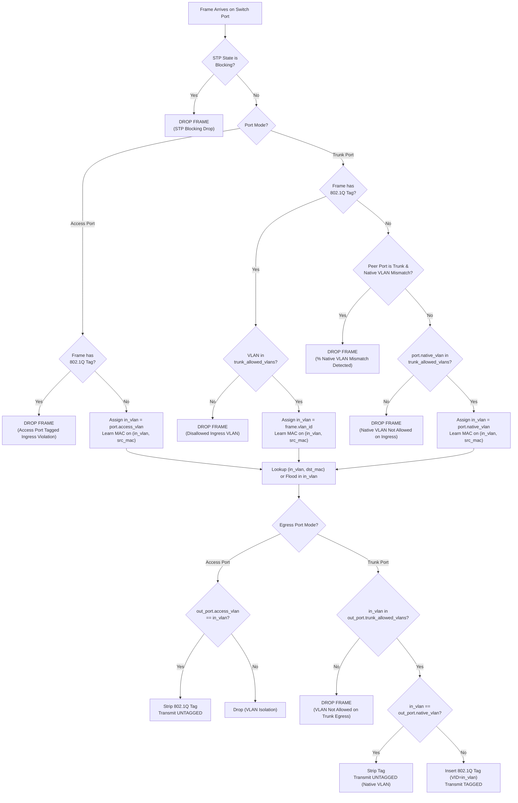

# IEEE 802.1Q VLAN Trunking Documentation (Phase 4.5)

เอกสารทางเทคนิคอธิบายสถาปัตยกรรมและการทำงานของ **IEEE 802.1Q VLAN Trunking** ในเครือข่ายจำลอง NetEngineer 3D

---

## 1. บทนำและภาพรวม (Introduction & Architectural Overview)

ในเครือข่ายสวิตช์ระดับองค์กร (Enterprise Ethernet Switches) พอร์ตสวิตช์แบ่งออกเป็น 2 โหมดหลักตามมาตรฐาน IEEE 802.1Q:

1. **Access Port**:
   - เชื่อมต่อกับโฮสต์เดี่ยว (End Host / PC / Server)
   - ส่งออกเฟรมเป็น **Untagged** เสมอ
   - ปฏิเสธเฟรมที่มีแท็ก 802.1Q ขาเข้า (Ingress Drop)
   - สังกัดอยู่ใน VLAN เดียวตามการตั้งค่า `access_vlan` (ค่าเริ่มต้นคือ VLAN 1)

2. **Trunk Port (IEEE 802.1Q Trunk)**:
   - เชื่อมต่อระหว่าง Switch กับ Switch หรือ Switch กับ Router (Router-on-a-Stick)
   - สามารถส่งและรับทราฟฟิกของหลาย VLAN พร้อมกันผ่านลิงก์กายภาพเส้นเดียว
   - แทรกแท็ก **IEEE 802.1Q Header (4 Bytes)** สำหรับทราฟฟิกที่เป็น Non-Native VLAN
   - ทราฟฟิกที่เป็น **Native VLAN** จะถูกส่งออกเป็น **Untagged**
   - มี **Allowed VLAN List** สำหรับควบคุมการส่งผ่านทราฟฟิกเฉพาะ VLAN ที่ได้รับอนุญาต
   - มีระบบตรวจจับ **Native VLAN Mismatch** เพื่อป้องกันปัญหา VLAN Leaking



---

## 2. โครงสร้างเฟรม IEEE 802.1Q (Frame Encapsulation)

เมื่อเฟรมถูกส่งออกผ่าน Trunk Port สำหรับ VLAN ที่ไม่ใช่ Native VLAN ตัวสวิตช์จะแทรกแท็กขนาด 4 ไบต์ (32 บิต) เข้าไปหลัง Source MAC Address ก่อน EtherType เดิม:

| Field | ขนาด (Bits) | คำอธิบาย |
| :--- | :--- | :--- |
| **TPID (Tag Protocol Identifier)** | 16 bits | มีค่าคงที่ `0x8100` ระบุว่าเป็นเฟรมที่แท็กตามมาตรฐาน IEEE 802.1Q |
| **PCP (Priority Code Point)** | 3 bits | คุณภาพการบริการ (Class of Service / QoS: 0-7) |
| **DEI (Drop Eligible Indicator)** | 1 bit | ตัวบ่งชี้ความพร้อมในการทิ้งเฟรมเมื่อเกิดความคับคั่ง (เดิมคือ CFI) |
| **VID (VLAN Identifier)** | 12 bits | หมายเลข VLAN ตั้งแต่ `1` ถึง `4094` (`0` และ `4095` สงวนไว้) |

---

## 3. วงจรการประมวลผลทราฟฟิก (Ingress & Egress Pipelines)



### 3.1 Ingress Pipeline (พอร์ตขาเข้า)
1. **STP State Check**: หากพอร์ตอยู่ในสถานะ `Blocking` สวิตช์จะทิ้งเฟรมทันที ไม่ส่งต่อ และไม่เรียนรู้ Source MAC
2. **Access Port Ingress**:
   - หากเฟรมมีแท็ก 802.1Q: ปฏิเสธและทิ้งเฟรมทันที (`Access port dropped tagged frame`)
   - หากเป็น Untagged: กำหนด `in_vlan = port.access_vlan`
3. **Trunk Port Ingress**:
   - หากเฟรมมีแท็ก 802.1Q:
     - ตรวจสอบว่าหมายเลข VLAN อยู่ใน `trunk_allowed_vlans` หรือไม่ หากไม่อยู่ ให้ทิ้งเฟรมทันที
     - หากอยู่ใน Allowed list ให้กำหนด `in_vlan = tag_vlan`
   - หากเป็น Untagged:
     - ตรวจสอบความสอดคล้องของ Native VLAN ระหว่างพอร์ตต้นทางและปลายทาง (`peer_port.native_vlan == out_port.native_vlan`) หากไม่ตรงกัน สวิตช์จะทิ้งเฟรมทันทีเพื่อป้องกัน VLAN Leaking
     - ตรวจสอบว่า `port.native_vlan` อยู่ใน `trunk_allowed_vlans` หรือไม่ หากไม่อยู่ ให้ทิ้งเฟรม
     - กำหนด `in_vlan = port.native_vlan`
4. **Source MAC Learning**:
   - บันทึกการเรียนรู้ลงในตารางคู่ `(in_vlan, src_mac) -> port.name`

### 3.2 Egress Pipeline (พอร์ตขาออก)
1. **STP State Check**: หากพอร์ตขาออกอยู่ในสถานะ `Blocking` จะไม่ส่งเฟรมออกเด็ดขาด
2. **Access Port Egress**:
   - ต้องมี `port.access_vlan == in_vlan`
   - ปลดแท็ก 802.1Q ออกเสมอ ส่งออกเป็น **Untagged Frame**
3. **Trunk Port Egress**:
   - ตรวจสอบว่า `in_vlan` อยู่ใน `port.trunk_allowed_vlans` หรือไม่ หากไม่อยู่ จะไม่ส่งเฟรมออก
   - หาก `in_vlan == port.native_vlan`: ส่งออกเป็น **Untagged Frame**
   - หาก `in_vlan != port.native_vlan`: แทรกแท็ก 802.1Q และส่งออกเป็น **Tagged Frame**

---

## 4. ตาราง MAC Address แบบ Per-VLAN (Per-VLAN MAC Learning)

ในสถาปัตยกรรม Shared VLAN Learning (SVL) แบบดั้งเดิม สวิตช์เรียนรู้เฉพาะ MAC Address โดยไม่คำนึงถึง VLAN ส่งผลให้เกิด MAC Flooding ข้าม VLAN หรือ MAC Flipping
ใน Phase 4.5 ได้อัปเกรดเป็น **Independent VLAN Learning (IVL)**:

- สวิตช์จัดเก็บตารางสองชั้น:
  1. `self.mac_vlan_table[(vlan_id, mac)] = port.name` (Strict IVL Forwarding Table)
  2. `self.mac_table[mac] = port.name` (Backward compatibility สำหรับ CLI และ UI)
- เมื่อเฟรมเข้ามาใน VLAN 10 สวิตช์จะเรียนรู้ `(10, MAC_A)` บนพอร์ตที่รับเข้ามา
- เมื่อเฟรมเข้ามาใน VLAN 20 ด้วย MAC_A เดียวกัน สวิตช์จะเรียนรู้ `(20, MAC_A)` แยกต่างหากโดยไม่กระทบกับ VLAN 10
- การค้นหา Forwarding Destination จะค้นหาจาก `(in_vlan, dst_mac)` ก่อนเสมอ หากไม่พบ จะทำการ Flood เฉพาะพอร์ตที่เป็นสมาชิกของ `in_vlan` เท่านั้น

---

## 5. การรวมระบบกับฟังก์ชันเครือข่ายเดิม (Subsystem Integrations)

| ระบบย่อย | ผลกระทบและพฤติกรรมหลังรวมกับ 802.1Q Trunk |
| :--- | :--- |
| **STP (IEEE 802.1D)** | พอร์ตที่เป็น Trunk เข้าร่วมกระบวนการ STP ตามปกติ หากพอร์ต Trunk ตกอยู่ในสถานะ `Blocking` จะทิ้งทราฟฟิกทุก VLAN ทันที ไม่ส่งต่อ ไม่ Flood และไม่เรียนรู้ MAC |
| **Router Subinterfaces** | เราเตอร์รองรับ 802.1Q Encapsulation (`encapsulation dot1q <vlan>`) ผ่านทาง Subinterfaces (`g0/0.10`, `g0/0.20`) โดยเฟรมที่ส่งจาก Subinterface จะมีสถานะ `is_tagged=True` และผ่าน Trunk Port ไปยัง Host ปลายทางได้อย่างสมบูรณ์ (Router-on-a-Stick) |
| **SVI (Switch Virtual Interface)** | สวิตช์สามารถสร้าง SVI ประจำ VLAN (`interface Vlan10`) และส่งทราฟฟิกระดับ Layer 3 ข้าม Trunk Port ไปยัง SVI บนอีกสวิตช์หนึ่งได้ โดยสวิตช์ต้นทางจะส่งเฟรมออกผ่าน Trunk Port ที่อนุญาต VLAN นั้น และแท็ก 802.1Q อย่างถูกต้อง |
| **DHCP Server** | DHCP Server บน Router สามารถกระจาย IP Address แยก Pool ตาม VLAN ผ่านทาง 802.1Q Trunk Subinterfaces ได้อย่างอิสระ โฮสต์ในแต่ละ VLAN ได้รับ IP และ Default Gateway ประจำ VLAN ตนเองอย่างถูกต้อง |
| **Dynamic Routing (RIPv2 & OSPFv2)** | เราเตอร์สามารถสร้าง Neighbor Adjacency (FULL state) และแลกเปลี่ยนเส้นทาง (Routing Updates / LSAs) ข้ามพอร์ต Trunk ผ่าน Router Subinterfaces ได้อย่างสมบูรณ์ |
| **Security (ACL, NAT, Firewall)** | กลไกความปลอดภัยใน Data Plane (Access-Lists, Cisco NAT, Stateful Inspection) ยังคงทำงานร่วมกับทราฟฟิกที่ผ่าน Trunk Port ได้อย่างถูกต้องโดยไม่มีข้อผิดพลาด |

---

## 6. Cisco IOS CLI Commands Reference

### 6.1 การตั้งค่าโหมดพอร์ต
```cisco
Switch(config)# interface GigabitEthernet 0/8
Switch(config-if)# switchport mode trunk
Switch(config-if)# switchport mode access
Switch(config-if)# no switchport mode
```

### 6.2 การตั้งค่า Allowed VLANs
รองรับการระบุเป็นรายหมายเลข คั่นด้วยเครื่องหมายจุลภาค (Comma) และระบุเป็นช่วง (Range):
```cisco
Switch(config-if)# switchport trunk allowed vlan 10,20,30
Switch(config-if)# switchport trunk allowed vlan 10-20
Switch(config-if)# switchport trunk allowed vlan 10-15,20,30-40
Switch(config-if)# no switchport trunk allowed vlan
```

### 6.3 การตั้งค่า Native VLAN
```cisco
Switch(config-if)# switchport trunk native vlan 99
Switch(config-if)# no switchport trunk native vlan
```

### 6.4 คำสั่งตรวจสอบสถานะ (Verification Commands)
```cisco
Switch# show interfaces trunk
Port        Mode             Encapsulation  Status        Native vlan
g0/8        trunk            802.1q         trunking      1

Port        Vlans allowed on trunk
g0/8        1-4094

Switch# show interfaces GigabitEthernet 0/8 switchport
Name: g0/8
Switchport: Enabled
Administrative Mode: trunk
Operational Mode: trunk
Administrative Trunking Encapsulation: dot1q
Operational Trunking Encapsulation: dot1q
Negotiation of Trunking: Off
Access Mode VLAN: 1 (default)
Trunking Native Mode VLAN: 1 (default)
Administrative Native VLAN tagging: disabled
Voice VLAN: none
Administrative private-vlan host-association: none
Administrative private-vlan mapping: none
Administrative private-vlan trunk native VLAN: none
Administrative private-vlan trunk Native VLAN tagging: enabled
Administrative private-vlan trunk encapsulation: dot1q
Administrative private-vlan trunk normal VLANs: none
Administrative private-vlan trunk private VLANs: none
Operational private-vlan: none
Trunking VLANs Enabled: 1-4094
Pruning VLANs Enabled: 2-1001
Capture Mode Disabled
Capture VLANs Allowed: ALL
Protected: false
Unknown unicast blocked: disabled
Unknown multicast blocked: disabled
Appliance trust: none
STP State: Forwarding
```

---

## 7. ขอบเขตและข้อจำกัดที่ทราบ (Known Limitations & Scope Boundaries)

1. **Static Trunking Only**: การตั้งค่า Trunk ทำผ่านคำสั่ง `switchport mode trunk` แบบคงที่ ไม่รองรับโปรโตคอลการเจรจาอัตโนมัติ DTP (Dynamic Trunking Protocol) หรือ VTP (VLAN Trunking Protocol)
2. **Single Spanning Tree (IEEE 802.1D)**: ระบบรัน STP ระดับสวิตช์ ไม่รองรับ PVST+ (Per-VLAN Spanning Tree), Rapid PVST+, หรือ MSTP
3. **No EtherChannel / Port Aggregation**: พอร์ต Trunk แต่ละพอร์ตทำงานอิสระ ไม่รองรับ LACP หรือ PAgP
4. **No QinQ (802.1ad)**: ไม่รองรับ Double VLAN Tagging (QinQ) หรือ Service Provider Tagging
5. **Deterministic Native VLAN Mismatch Protection**: หากพอร์ต Trunk ที่เชื่อมต่อกันมี Native VLAN ไม่ตรงกัน ระบบจะดรอปเฟรม Untagged ทันทีเพื่อป้องกันปัญหาความปลอดภัย
